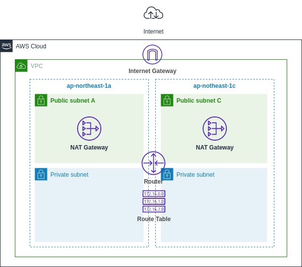

# VPC Template

## vpc-with-multi-az-natgw-and-private-subnet
### Structure
| Resource  | Number |
| ----      | ----   |
| VPC       | 1      |
| Public Subnet   | 2 |
| Private Subnet  | 2 |
| NAT Gateway     | 2 |

